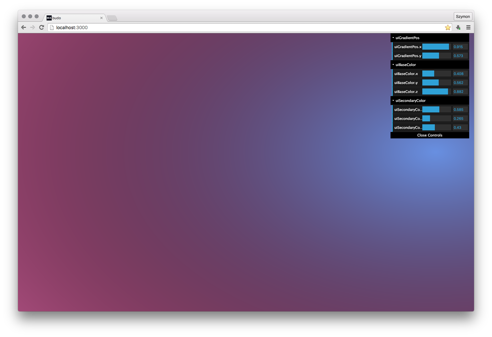

# glsl-auto-ui

**This is experimental module, if something doesn't work don't get angry and post an issue. PR's are more than welcome!**

Automatic DAT.GUI generation from GLSL uniforms.

<p align="center"></p>

Just name your UI uniforms starting with "ui": "uiColorModifier", etc.
Currently only supports `float`, `vec2`, `vec3`, `vec4`.

Uniforms default to `0.01` (to fix bug where float sliders in DAT.GUI display only 0 or 1).
Uniforms are normalized to `0.0` - `1.0`, you can always multiple, subtract, add, etc. in GLSL code.

## Installation

```bash
$ npm install glsl-auto-ui
```

## Usage

```javascript
const { generateUI, updateGLSLToyShaderUniforms } = require('glsl-auto-ui');

// get shader from somewhere
const glslify = require('glslify');
const shader  = glslify('./shader.frag');

const { GUI } = require('dat-gui');
const gui     = new GUI();

// generate UI using DAT GUI instance, and shader string
// you don't need glslify, you just have to pass the shader string here
let params = generateUI(gui, shader);

// currently only "supports" gl-toy
const toy = require('gl-toy');

toy(shader, (gl, shader) => {
  updateGLSLToyShaderUniforms(shader.uniforms, params);
});
```

This code will not really work, because `DAT.GUI` needs to be created after gl-toy, look into `examples/gl-toy` for more info.

